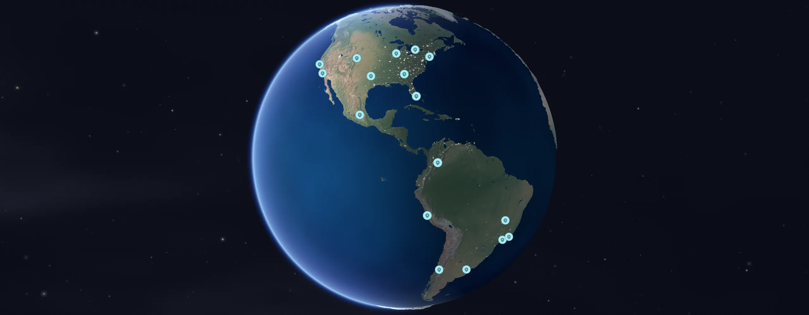
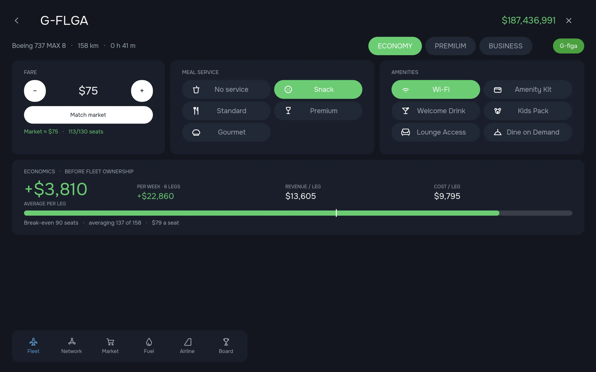
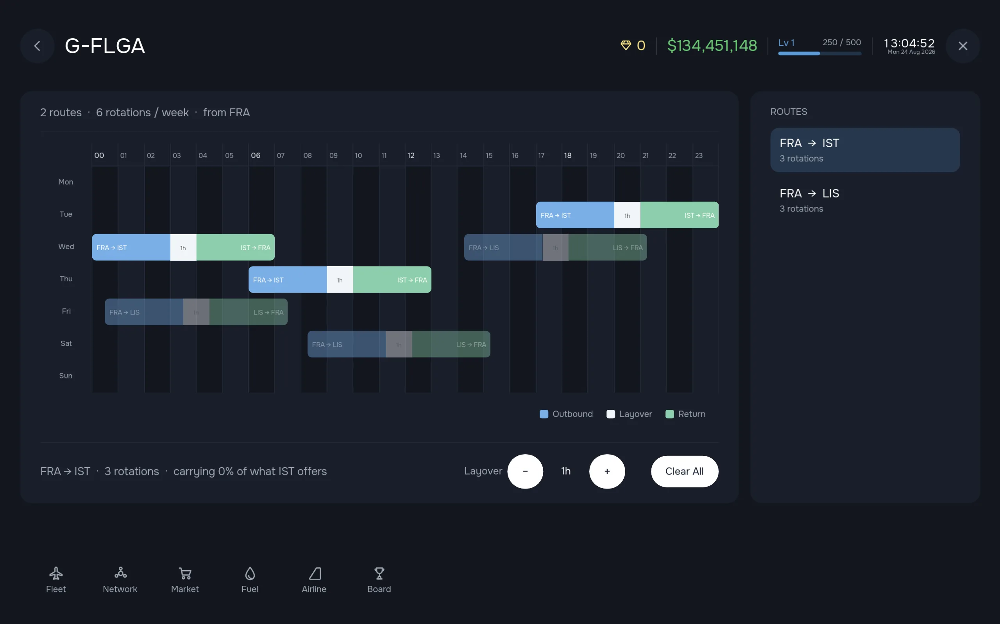
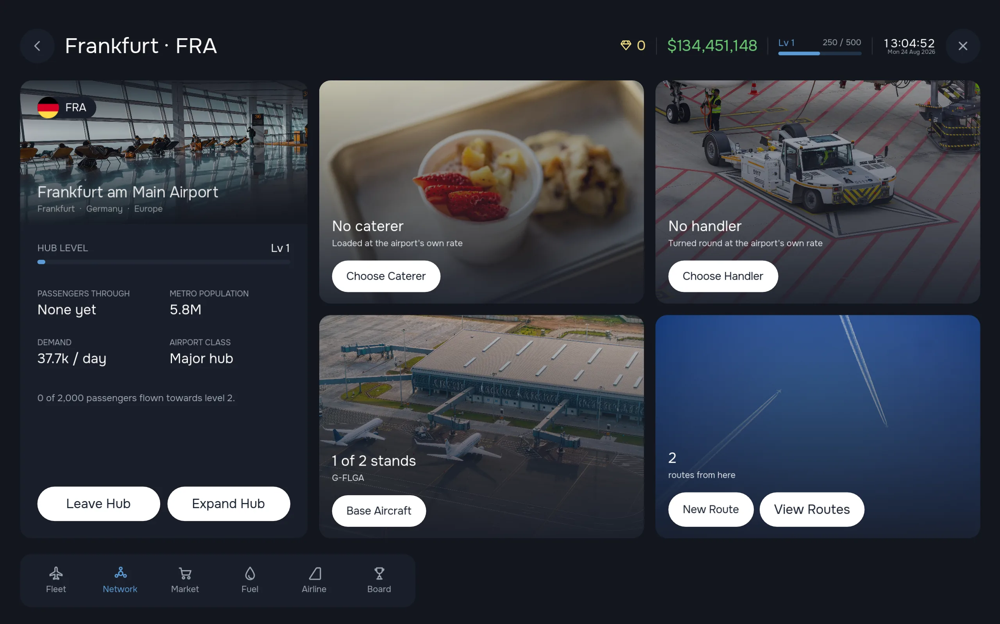

# Vreeburg Games

**An independent studio making simulation games for people who like to know how things work.**

---

## ✈️ Project Airline

*Build your airline empire.*

**Project Airline** is an airline management game on a real 3D globe. You buy aircraft, base them at hubs, draw routes between real airports, fit the cabins, price the seats and run the timetable that pays for all of it.

The simulation is the game:

- **Real demand.** Passengers come from an origin–destination matrix, not a shared pool at each airport.
- **Real aircraft.** Real seat counts, ranges and fuel burn, and every cost on a flight is checked against real airline figures.
- **Real costs.** You pay for fuel (spot market plus a sustainable aviation fuel blend you choose), crew, maintenance, catering, ground handling, landing fees, carbon, and the cost of owning your fleet.
- **Your airline.** You pick its name, IATA code, logo and livery. Hubs grow through 10 levels. You sign catering and ground-handling contracts, lease aircraft and compete with rival carriers.
- **Airport dioramas.** Every hub has a clay-model version of its airport and the city beside it. A plane takes off, flies a circuit and lands while the lights come on after dark.

<table>
  <tr>
    <td width="33%"></td>
    <td width="33%"></td>
    <td width="33%"></td>
  </tr>
  <tr>
    <td align="center">Plan routes on the globe</td>
    <td align="center">Lay out your weekly timetable</td>
    <td align="center">Grow your hubs</td>
  </tr>
</table>

   
  
   
  Wishlisting helps us more than anything else. Thank you!

---

## 💬 Say hello

Want to playtest, suggest a feature or talk about airplanes? Join us on **[Discord](https://discord.gg/mVbD4HsKrA)**.

   
  Built in Godot. Made for aviation nerds.

